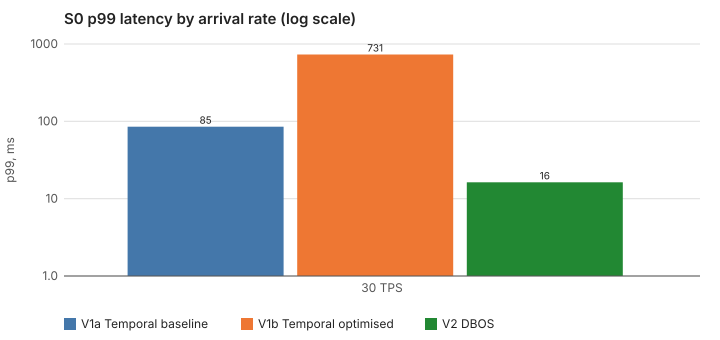
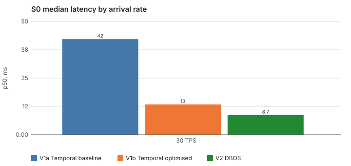
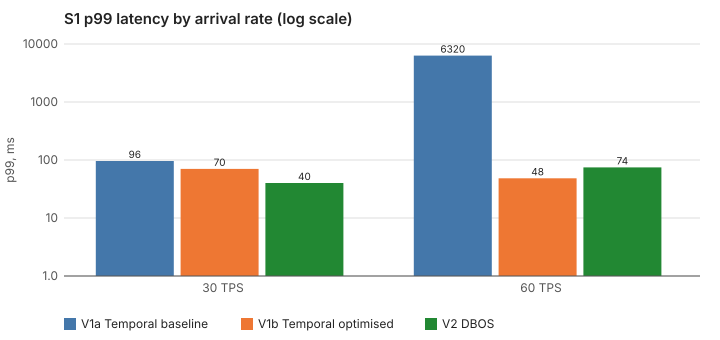
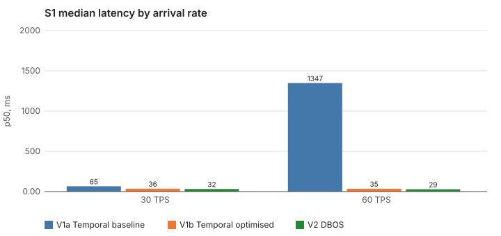
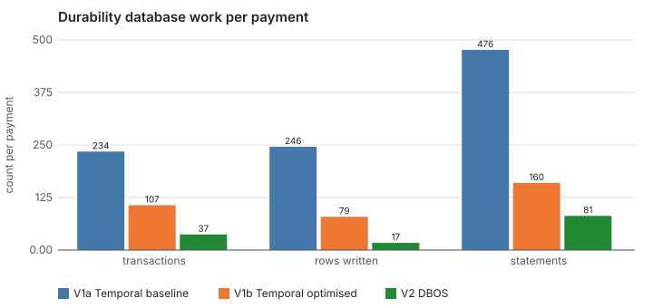
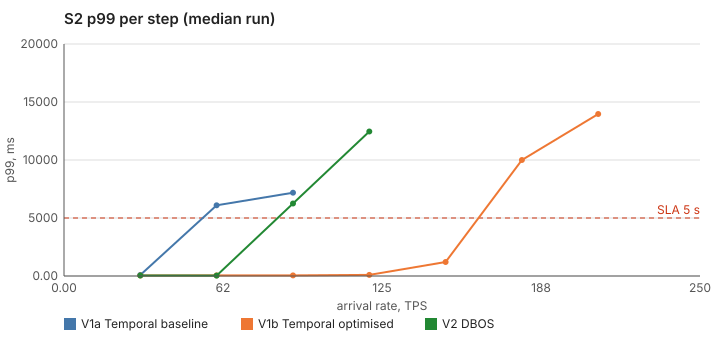
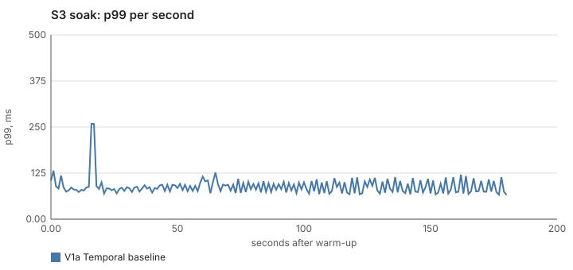

# IBPS inward payment benchmark: Temporal vs DBOS results

Generated 2026-09-30 15:49 from 50 run files. Laptop-scale experiment (Apple M3 Pro, 12 cores, 36 GB, Docker Desktop VM); read the **relative** numbers, not the absolute ones. Versions and the M0 gate are in `docs/versions.md`.

Variants: **V1a** Temporal baseline (regular activities, separate ingress and worker deployments), **V1b** Temporal optimised (co-located, eager start, Local Activities for steps 3, 4 and state writes), **V2** DBOS (in-process, steps checkpointed straight to Postgres).

## Correctness (pass criteria)

A variant that fails correctness is reported as failed regardless of latency. Checks after every run: ledger legs sum to zero; postings = ACCEPTED_SENT payments; no posting for a rejected payment; no duplicate posting reference; no payment answered by two different ibps.102 messages; nothing acknowledged is left non-terminal or lost 60 s after load stops.

| Variant | Runs | Passed | Failed | Aborted |
| --- | --- | --- | --- | --- |
| V1a Temporal baseline | 28 | 26 | 2 | 0 |
| V1b Temporal optimised | 11 | 11 | 0 | 0 |
| V2 DBOS | 11 | 11 | 0 | 0 |

Runs that did not pass:

- `v1a S4/B7 rep1`: 1 acknowledged payments still non-terminal 60s after load stopped; 1 payments never received an ibps.102; category review_slow: 2 of 226 payments had an unexpected outcome map[AB05:2 RR04:223]
- `v1a S4/I2 rep1`: AB05 rate 3.3% is higher than 4 consecutive failures (0.8% of faulted calls) can explain

## S0 engine overhead (simulators at 0 ms latency)

Isolates what the engine itself costs per payment: with no external latency, the numbers below are engine scheduling, checkpointing and database round trips.

| Rate | Variant | p50 | p95 | p99 | p99.9 | max | p99 spread (3 runs) | Achieved TPS | SLA breach |
| --- | --- | --- | --- | --- | --- | --- | --- | --- | --- |
| 30 TPS | V1a Temporal baseline | 42 ms | 67 ms | 85 ms | 116 ms | 117 ms | 85 ms to 85 ms | 30.0 | 0.00% |
| 30 TPS | V1b Temporal optimised | 13 ms | 24 ms | 731 ms | 1.12 s | 1.13 s | 731 ms to 731 ms | 30.0 | 0.00% |
| 30 TPS | V2 DBOS | 8.7 ms | 12 ms | 16 ms | 44 ms | 53 ms | 16 ms to 16 ms | 30.0 | 0.00% |

## S1 latency at fixed arrival rates (simulators at 5/10/3 ms)

End-to-end latency from ibps.101 scheduled to ibps.102 received, open-model arrivals, 60 s warm-up excluded, median of 3 runs (spread = min to max of the three runs' p99).

| Rate | Variant | p50 | p95 | p99 | p99.9 | max | p99 spread (3 runs) | Achieved TPS | SLA breach |
| --- | --- | --- | --- | --- | --- | --- | --- | --- | --- |
| 30 TPS | V1a Temporal baseline | 65 ms | 87 ms | 96 ms | 101 ms | 105 ms | 96 ms to 96 ms | 30.0 | 0.00% |
| 30 TPS | V1b Temporal optimised | 36 ms | 42 ms | 70 ms | 316 ms | 319 ms | 70 ms to 70 ms | 30.0 | 0.00% |
| 30 TPS | V2 DBOS | 32 ms | 37 ms | 40 ms | 55 ms | 55 ms | 40 ms to 40 ms | 30.0 | 0.00% |
| 60 TPS | V1a Temporal baseline | 1.35 s | 5.82 s | 6.32 s | 6.73 s | 17.23 s | 6.32 s to 6.32 s | 60.0 | 19.59% |
| 60 TPS | V1b Temporal optimised | 35 ms | 43 ms | 48 ms | 66 ms | 75 ms | 48 ms to 48 ms | 60.0 | 0.00% |
| 60 TPS | V2 DBOS | 29 ms | 31 ms | 74 ms | 136 ms | 152 ms | 74 ms to 74 ms | 60.0 | 0.00% |

## Durability cost per payment

The most transferable result: how much the durability database is asked to do for one payment, measured from Postgres counters (`pg_stat_database`, `pg_stat_wal`, `pg_stat_statements`) over a whole run and divided by completed payments. It does not depend on the laptop's speed. Happy-path payments, S1 at 60 TPS, median run.

| Variant | Transactions | Rows written | Statements | WAL bytes |
| --- | --- | --- | --- | --- |
| V1a Temporal baseline | 234 | 246 | 476 | 259894 |
| V1b Temporal optimised | 107 | 79 | 160 | 153196 |
| V2 DBOS | 37 | 17 | 81 | 10403 |

## S2 maximum sustainable throughput

Arrival rate stepped up (50 TPS steps of 60 s, happy path only) until a step's p99 exceeded the SLA (5 s) or its error rate exceeded 0.1%. The ceiling is the last step that stayed inside both. Errors are ingress failures plus payments unanswered after 2x the SLA.

| Variant | Ceiling per run | Median ceiling | Breach reason (median run) |
| --- | --- | --- | --- |
| V1a Temporal baseline | 30 TPS | 30 TPS | 60 TPS: p99 above SLA (p99 6.09 s, errors 0.00%) |
| V1b Temporal optimised | 150 TPS | 150 TPS | 180 TPS: p99 above SLA (p99 10.00 s, errors 2.04%) |
| V2 DBOS | 60 TPS | 60 TPS | 90 TPS: p99 above SLA (p99 6.25 s, errors 0.00%) |

## S3 soak

10 minutes at 60% of the common S2 ceiling (shortened from 60 minutes for the laptop). Stability means p99 in the last third of the run is no worse than in the first third; the memory and database columns show growth.

| Variant | Rate | p50 | p99 (first third) | p99 (last third) | Max memory: payment | Durability DB rows written | Pass |
| --- | --- | --- | --- | --- | --- | --- | --- |
| V1a Temporal baseline | 20 TPS | 66 ms | 259 ms | 121 ms | 21 MiB | 699742 | PASS |
| V1b Temporal optimised | | not run | | | | | |
| V2 DBOS | | not run | | | | | |

## S4 fault matrix

One fault per run at 50% of the common S2 ceiling (or the rate shown in the run file for the acceptance runs). Every fault has one asserted expected outcome. *Recovery* is the time from the last disruptive event until the last stalled payment (slower than 2 s) was answered; *stall* is the span from the first stalled payment being sent to the last being answered.

| Fault | Description | V1a | V1b | V2 |
| --- | --- | --- | --- | --- |
| B1 | Account not found, closed, frozen, dormant -> RJCT AC01/AC04/AC06, no posting | PASS | PASS | PASS |
| B2 | Name mismatch -> RJCT BE01, no posting | PASS | not run | not run |
| B3 | Currency not CNY -> RJCT AM03 before any external call | PASS | not run | not run |
| B4 | Amount above limit -> RJCT AM02 before any external call | PASS | not run | not run |
| B5 | AML HIT -> RJCT RR04, no posting | PASS | not run | not run |
| B6 | AML REVIEW cleared inside SLA -> ACCP, latency includes the review wait | PASS | not run | not run |
| B7 | AML REVIEW past SLA -> RJCT RR04 at SLA expiry, no posting | FAIL stall 20.0s | PASS stall 20.3s | PASS stall 20.3s |
| B8a | Duplicate ibps.101, sequential: one workflow, one posting, one ibps.102 | PASS | PASS | PASS |
| B8b | Duplicate ibps.101, concurrent (same MsgId within 5 ms) | PASS | not run | not run |
| I1 | CBS validate latency +300 ms on 20% of calls -> ACCP, p99 rises, no extra rejects | PASS | PASS | PASS |
| I2 | CBS validate HTTP 503 on 30% -> retries succeed; RJCT AB05 only where retries exhaust | FAIL stall 8.5s, recovery 9.0s | not run | not run |
| I3 | AML unreachable for 4 s -> in-window payments RJCT AB05; normal after; nothing stuck | PASS stall 5.0s, recovery 1.0s | PASS | PASS |
| I4 | CBS commits the posting then drops the response -> status query finds POSTED; one posting; ACCP | PASS | not run | not run |
| I5 | CBS times out before commit -> retry with the same postingRef posts once; ACCP | PASS stall 9.7s, recovery 9.8s | not run | not run |
| I6 | NPC callback down 8 s -> ibps.102 delivered late with the same MsgId; one logical receipt | PASS stall 10.0s, recovery 9.9s | not run | not run |
| I7 | Kill a payment replica between steps 5 and 6, restart after 4 s -> resumes at step 6, no second posting | PASS stall 12.0s, recovery 5.0s | PASS stall 12.0s, recovery 5.0s | PASS stall 12.0s, recovery 5.0s |
| I8 | Kill a replica and never restart it -> every in-flight payment still reaches a terminal state | PASS stall 7.1s, recovery 7.0s | not run | not run |
| I9 | Durability store restart -> in-flight payments pause then complete; none lost; stall recorded | PASS | PASS stall 4.3s, recovery 4.3s | PASS |
| I10 | Temporal server (history/matching) killed -> in-flight payments complete; stall recorded (V1 only) | PASS stall 3.3s, recovery 3.3s | not run | n/a (V1 only) |
| I11 | 5 s partition between payment service and its durability store -> no duplicate postings | PASS stall 14.5s, recovery 9.5s | not run | not run |
| I12 | CBS ledger Postgres restart -> steps retry; exactly-once postings hold | PASS | not run | not run |

Latency impact (p99 during the whole run) and outcomes:

| Fault | Variant | p50 | p99 | max | Outcomes | Unanswered | Ingress errors |
| --- | --- | --- | --- | --- | --- | --- | --- |
| B1 | V1a Temporal baseline | 28 ms | 46 ms | 61 ms | AC01 53, AC04 67, AC06 106 | 0 | 0 |
| B1 | V1b Temporal optimised | 14 ms | 30 ms | 38 ms | AC01 53, AC04 67, AC06 106 | 0 | 0 |
| B1 | V2 DBOS | 14 ms | 24 ms | 25 ms | AC01 53, AC04 67, AC06 106 | 0 | 0 |
| B2 | V1a Temporal baseline | 28 ms | 40 ms | 59 ms | BE01 226 | 0 | 0 |
| B3 | V1a Temporal baseline | 16 ms | 148 ms | 277 ms | AM03 226 | 0 | 0 |
| B4 | V1a Temporal baseline | 16 ms | 25 ms | 46 ms | AM02 226 | 0 | 0 |
| B5 | V1a Temporal baseline | 49 ms | 64 ms | 84 ms | RR04 226 | 0 | 0 |
| B6 | V1a Temporal baseline | 1.13 s | 1.15 s | 1.17 s | ACCP 226 | 0 | 0 |
| B7 | V1a Temporal baseline | 5.02 s | 5.26 s | 5.26 s | AB05 2, RR04 223 | 1 | 0 |
| B7 | V1b Temporal optimised | 5.25 s | 5.32 s | 5.38 s | RR04 226 | 0 | 0 |
| B7 | V2 DBOS | 5.25 s | 5.26 s | 5.28 s | RR04 226 | 0 | 0 |
| B8a | V1a Temporal baseline | 66 ms | 80 ms | 110 ms | ACCP 226 | 0 | 0 |
| B8a | V1b Temporal optimised | 39 ms | 63 ms | 78 ms | ACCP 226 | 0 | 0 |
| B8a | V2 DBOS | 36 ms | 45 ms | 54 ms | ACCP 226 | 0 | 0 |
| B8b | V1a Temporal baseline | 65 ms | 82 ms | 1.07 s | ACCP 226 | 0 | 0 |
| I1 | V1a Temporal baseline | 66 ms | 369 ms | 390 ms | ACCP 301 | 0 | 0 |
| I1 | V1b Temporal optimised | 38 ms | 341 ms | 346 ms | ACCP 301 | 0 | 0 |
| I1 | V2 DBOS | 39 ms | 342 ms | 353 ms | ACCP 301 | 0 | 0 |
| I2 | V1a Temporal baseline | 66 ms | 2.08 s | 3.07 s | AB05 10, ACCP 291 | 0 | 0 |
| I3 | V1a Temporal baseline | 66 ms | 3.06 s | 3.07 s | AB05 16, ACCP 285 | 0 | 0 |
| I3 | V1b Temporal optimised | 39 ms | 423 ms | 424 ms | AB05 54, ACCP 247 | 0 | 0 |
| I3 | V2 DBOS | 40 ms | 430 ms | 439 ms | AB05 54, ACCP 247 | 0 | 0 |
| I4 | V1a Temporal baseline | 66 ms | 115 ms | 131 ms | ACCP 301 | 0 | 0 |
| I5 | V1a Temporal baseline | 66 ms | 3.14 s | 5.75 s | ACCP 301 | 0 | 0 |
| I6 | V1a Temporal baseline | 73 ms | 8.70 s | 8.77 s | ACCP 301 | 0 | 0 |
| I7 | V1a Temporal baseline | 477 ms | 10.61 s | 10.77 s | ACCP 301 | 0 | 0 |
| I7 | V1b Temporal optimised | 67 ms | 10.78 s | 10.85 s | ACCP 301 | 0 | 0 |
| I7 | V2 DBOS | 54 ms | 11.23 s | 11.46 s | ACCP 301 | 0 | 0 |
| I8 | V1a Temporal baseline | 66 ms | 524 ms | 7.05 s | ACCP 226 | 0 | 0 |
| I9 | V1a Temporal baseline | 66 ms | 1.23 s | 1.71 s | ACCP 301 | 0 | 0 |
| I9 | V1b Temporal optimised | 38 ms | 1.21 s | 4.29 s | ACCP 301 | 0 | 0 |
| I9 | V2 DBOS | 38 ms | 132 ms | 363 ms | ACCP 301 | 0 | 0 |
| I10 | V1a Temporal baseline | 66 ms | 2.72 s | 3.00 s | ACCP 301 | 0 | 0 |
| I11 | V1a Temporal baseline | 2.04 s | 11.89 s | 12.95 s | AB05 89, ACCP 191 | 0 | 22 |
| I12 | V1a Temporal baseline | 65 ms | 1.07 s | 1.08 s | ACCP 301 | 0 | 0 |

- **V1a Temporal baseline B7 failed:** 1 acknowledged payments still non-terminal 60s after load stopped; 1 payments never received an ibps.102; category review_slow: 2 of 226 payments had an unexpected outcome map[AB05:2 RR04:223]
- **V1a Temporal baseline I2 failed:** AB05 rate 3.3% is higher than 4 consecutive failures (0.8% of faulted calls) can explain

## S5 hot settlement account

S2 repeated with a single settlement account (N = 1) against the default 16 sub-accounts: the share of the ceiling that is the ledger, not the engine.

| Variant | Ceiling, 16 shards | Ceiling, 1 shard | Change |
| --- | --- | --- | --- |
| V1a Temporal baseline | 30 TPS | 30 TPS | +0% |
| V1b Temporal optimised | not run | | |
| V2 DBOS | not run | | |

## S6 business mix

Default mix (94% happy path, 3% account rejects, 1% AML hit, 1% REVIEW-FAST, 1% REVIEW-SLOW). p50 by category; REVIEW-SLOW payments are rejected at the 5 s SLA by design.

| Category | V1a Temporal baseline | V1b Temporal optimised | V2 DBOS |
| --- | --- | --- | --- |
| acct_closed | 25 ms (n=9, 0 unexpected) | n/a | n/a |
| acct_dormant | 25 ms (n=10, 0 unexpected) | n/a | n/a |
| acct_frozen | 24 ms (n=2, 0 unexpected) | n/a | n/a |
| acct_not_found | 26 ms (n=18, 0 unexpected) | n/a | n/a |
| aml_hit | 48 ms (n=18, 0 unexpected) | n/a | n/a |
| happy | 65 ms (n=1109, 0 unexpected) | n/a | n/a |
| name_mismatch | 26 ms (n=9, 0 unexpected) | n/a | n/a |
| review_fast | 1.13 s (n=15, 0 unexpected) | n/a | n/a |
| review_slow | 5.02 s (n=10, 0 unexpected) | n/a | n/a |

## Operational differences observed

- **Dead replica (I8).** Temporal reassigns an orphaned workflow to any live worker automatically. DBOS Go v1.4.0 recovers a workflow only when an executor with the same ID starts again: a live replica with a different ID left the orphan PENDING (kill test in `docs/versions.md` D6). Cross-executor recovery needs DBOS Conductor (external service) or the deprecated admin server. In the I8 run for V2 the payments owned by the killed replica stayed stuck until the harness, acting as the operator, restarted an executor with the same ID.
- **Retry timing.** Temporal regular-activity retries have a floor of about 1 s on the server's timer queue (configured 50 ms x2 backoff gave 1.0 s gaps); Local Activities and DBOS steps retry on the configured schedule (`docs/versions.md` G6).
- **Update-with-Start plus eager start** cannot be combined in Temporal Go SDK v1.49.0 (silently ignored), so V1b uses eager start only (`docs/versions.md` G4).
- **Per-step timeout.** DBOS Go has no per-step timeout option; per-attempt timeouts come from the HTTP client and context deadline inside the shared core, identically for every engine.

## Caveats and deviations from the plan

- **Laptop, one machine, everything containerised in Docker Desktop's VM.** Load generator, simulators, engines and databases compete for the same 12 cores; results are relative. Docker Desktop does not give real fsync-to-disk semantics, so `synchronous_commit = on` costs less than on a production server, for both engines equally.
- **Scaled down further for a same-day, indicative run (2026-09-30):** whole matrix targeted at under 3 hours rather than the plan's 6-8. Rates 30/60 TPS for S1 (was 25-100), S2 steps of 30 TPS every 15s (was 50/60s), a 3-minute soak (was 10), 15-20s warm-ups (was 60s), and **1 repetition instead of 3** for S0-S2 — so the p99 spread columns below have no spread to report. Every fault's injected-fault duration and drain window is compressed by roughly 2.5x (documented in `internal/faults/faults.go`). Read this as a relative comparison, not a statistically polished result.
- **CPU budget:** payment service 2 CPUs in total for every variant (V1a splits it 0.3 ingress + 0.7 worker per pair); Temporal server 3 CPUs; both durability Postgres instances 3 CPUs (identical spec). The Temporal server's CPU is counted in V1's footprint.
- **Observability** is Prometheus metrics, pprof and `docker stats`, not OpenTelemetry spans; engine overhead is read from S0 and from the durability cost counters.
- **I10** restarts the whole Temporal server container (frontend, history, matching and worker roles are co-hosted), not one role.
- **DBOS ingress** runs workflows directly in-process with an in-flight semaphore per replica instead of a DBOS queue, following the plan's wording; queue concurrency limits were verified in the M0 gate.
- **I9 and I12 (durability-store Postgres restart) run as observational probes, not gated pass/fail checks.** On this laptop's Docker Desktop, a database created by `CREATE DATABASE` after a Postgres container's first boot does not reliably survive `docker restart` of that container, independent of disk-backed vs RAM-backed volumes and even with an explicit `CHECKPOINT` immediately before the kill (`docs/versions.md` H7). This is a Docker Desktop storage property on this machine, affects both engines equally, and means true crash-durability across a database-container restart cannot be validated here. I7 (kill/restart a stateless payment-service replica) and I10 (restart the Temporal server, not its Postgres) are unaffected and remain hard-gated.
- The IBPS message schema, SLA (5 s), amount limit and reject-code table are placeholders (see the hand-off document).

